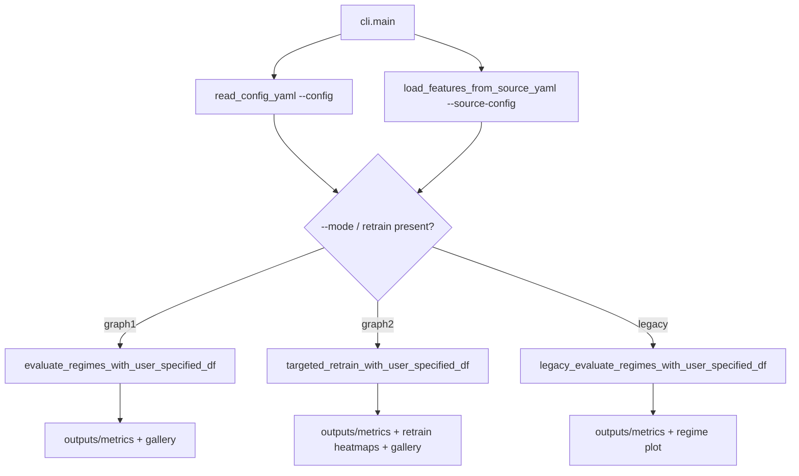
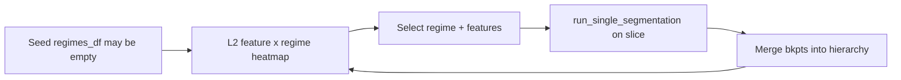
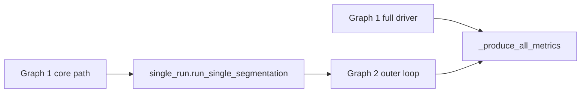

# Gulfstream

RegimeView pipelines for detecting structural breaks (regimes) in yield-curve / FX feature time series. Feature matrices are **polars** `DataFrame`s with a required `date` column (`gulfstream.common.frames`); pandas is only used at third-party boundaries (Excel I/O, and the final handoff into pytorch_forecasting's `TimeSeriesDataSet`).

- **Graph 1** — full regime detection (features → PCA/kPCA → RFF → ruptures → MMD → postprocess → plots / insights / explainability / robustness / stability)
- **Graph 2** — targeted retrain loop (L2 heatmap → pick regime + features → detect on slice → merge → repeat)
- **Legacy** — classical detectors (k-means, HDBSCAN, OPTICS, HMM, Bayesian GMM, MSAR, ruptures, Wasserstein) with optional DMD / t-SNE / UMAP dimred

Single-pass segmentation (shared by Graph 2 and robustness/stability) and CLI feature loading are [Apache Hamilton](https://hamilton.apache.org/) dataflows under `gulfstream.pipelines.hamilton`.

## Setup

```bash
uv sync
uv pip install -e .
```

## Run

Data comes from a **source YAML** (`--source-config`). Algorithm settings stay in `--config`.

`--mode` selects the pipeline (`graph1` | `graph2` | `legacy`). If omitted, Graph 2 is chosen when the config contains a `retrain` section.

```bash
# Core path (deferred stages off), synthetic jump data
uv run python -m gulfstream.cli --config config/graph1/default_core.yaml --source-config config/sources/synthetic.yaml

# Full Graph 1 with different sources
uv run python -m gulfstream.cli --mode graph1 --config config/graph1/full_graph1.yaml --source-config config/sources/synthetic.yaml
uv run python -m gulfstream.cli --config config/graph1/full_graph1.yaml --source-config config/sources/parquet.yaml
uv run python -m gulfstream.cli --config config/graph1/full_graph1.yaml --source-config config/sources/duckdb_smoke.yaml
uv run python -m gulfstream.cli --config config/graph1/full_graph1.yaml --source-config config/sources/csv.yaml

# Graph 2 auto retrain (empty seed → heatmaps → merge until threshold / max_iter)
uv run python -m gulfstream.cli --config config/graph2/full_graph2.yaml --source-config config/sources/synthetic.yaml
uv run python -m gulfstream.cli --mode graph2 --config config/graph2/full_graph2.yaml --source-config config/sources/duckdb_smoke.yaml

# Graph 2 interactive (stdin prompts for regime / features)
uv run python -m gulfstream.cli --config config/graph2/graph2_interactive.yaml --source-config config/sources/synthetic.yaml

# Legacy detectors (k-means / HDBSCAN / OPTICS / HMM smoke configs)
uv run python -m gulfstream.cli --mode legacy --config config/legacy/legacy_kmeans.yaml --source-config config/sources/synthetic.yaml
uv run python -m gulfstream.cli --mode legacy --config config/legacy/legacy_hdbscan.yaml --source-config config/sources/synthetic.yaml
uv run python -m gulfstream.cli --mode legacy --config config/legacy/legacy_optics.yaml --source-config config/sources/synthetic.yaml
uv run python -m gulfstream.cli --mode legacy --config config/legacy/legacy_hmm.yaml --source-config config/sources/synthetic.yaml
```

Dimred options for Graph 1 / Graph 2 / legacy configs:

| Method | Embedding emitted |
|--------|-------------------|
| `pca` / `kpca` / `raw` / `dmd` / `tsne` / `umap` | classical / manifold embeddings |
| `bayesian_gmm` | mixture responsibilities |
| `hmm` | posterior state probabilities |
| `kmeans` | distances to cluster centers |
| `hdbscan` | distances to HDBSCAN centroids (discovered ``k``) |
| `optics` | distances to OPTICS centroids (discovered ``k``) |
| `msar` | smoothed MSAR regime probabilities |
| `wasserstein` | Wasserstein distances to cluster centroids (window→series) |
| `ruptures` | distances to PELT/window/Dynp segment means |
| `tft` | TFT attention-vector embeddings (`rank` = hidden size) |

UMAP needs `umap-learn` (may be unavailable on Python 3.13). TFT needs `lightning` + `pytorch-forecasting` (installed); `mlflow` is optional and skipped by default due to pyarrow conflicts. Model-based dimred methods take `algo.regimes` where relevant (HDBSCAN/OPTICS/Wasserstein/ruptures-pelt may omit it; TFT uses `rank`). Post-information regime clustering is controlled by `metrics.regime_cluster_algorithms` (`kmeans` / `hdbscan` / `optics`; default `kmeans`).

```bash
# Graph 1 with model-based dimred
uv run python -m gulfstream.cli --mode graph1 --config config/graph1/graph1_hmm_dimred.yaml --source-config config/sources/synthetic.yaml
uv run python -m gulfstream.cli --mode graph1 --config config/graph1/graph1_kmeans_dimred.yaml --source-config config/sources/synthetic.yaml
uv run python -m gulfstream.cli --mode graph1 --config config/graph1/graph1_hdbscan_dimred.yaml --source-config config/sources/synthetic.yaml
uv run python -m gulfstream.cli --mode graph1 --config config/graph1/graph1_optics_dimred.yaml --source-config config/sources/synthetic.yaml
uv run python -m gulfstream.cli --mode graph1 --config config/graph1/graph1_ruptures_dimred.yaml --source-config config/sources/synthetic.yaml
uv run python -m gulfstream.cli --mode graph1 --config config/graph1/graph1_tft_dimred.yaml --source-config config/sources/synthetic.yaml
```

### Source types

| `type` | Key parameters |
|--------|----------------|
| `synthetic` | `case`, `regimes`, `features`, `durations`, `regime_params`, `seed` |
| `faker` | `n_days`, `n_regimes`, `sources`, `tenors`, `fx_pairs`, `seed` |
| `parquet` | `path`, optional `create_if_missing`, `generate_features` |
| `csv` | `path`, `date_column`, optional `columns`, `sep`, `start_date`/`end_date` |
| `duckdb` | `db_path`, `rate_table`, `sources`, `tenors`, `fx_pairs`, dates |
| `sqlite` | same shape as `duckdb` |

Example source configs live under `config/sources/`.

### Tutorial notebooks

End-to-end walkthroughs (markdown + plots + Hamilton single-pass) live under [`notebooks/`](notebooks/):

- `01_ycs_zero_rates_workflow.ipynb` — `zero_rates` / FX from `D:/data/duckdb/ycs_data.duckdb`
- `02_equity_eod_workflow.ipynb` — `equity_eod` from `D:/data/duckdb/equity_eod_data.duckdb`

See [`notebooks/README.md`](notebooks/README.md) for how to launch them.

Outputs land under `outputs/metrics/` and `outputs/logs/`.

---

## Workflow

Gulfstream is driven by one CLI entry that loads data once, then dispatches to Graph 1 or Graph 2.

### Entry call path



**Purpose:** keep data loading and algorithm config separate. `--source-config` chooses *what* series to analyze; `--config` chooses *how* to detect regimes and which post-run metrics to emit.

---

### Graph 1 — full regime detection

Graph 1 finds breakpoints over the whole series in one (parameter-grid) pass, then optionally scores and explains them.


| Stage | What it does | Why it exists |
|-------|----------------|---------------|
| **A — Core detection** | Reduce dimensions, map to a kernel feature space, propose breakpoints with ruptures, accept/reject with MMD, then clean segments. | Produce a single segmentation (`bkpts`, labels, hierarchy, stats) that is the baseline for everything else. |
| **B — Metrics** | Plot regimes, feature×regime L2 loss, regime distances/clusters, hierarchy trees, decision-tree explanations, transition probabilities; optionally perturb HPs (robustness) or drop sources/tenors/windows (stability). | Turn raw breakpoints into interpretable, stress-tested outputs under `outputs/metrics/`. |

Stage B is gated by `metrics.plot` and by `robustness.enabled` / `stability.enabled` in YAML (`config/full_graph1.yaml` turns the deferred stages on).

---

### Graph 2 — targeted retrain loop

Graph 2 does **not** invent a new detector. It wraps Graph 1’s single-run path (`run_single_segmentation`) in an outer loop that focuses on poorly explained regimes.



**Auto mode** (`retrain.interactive: false`): while `max(L2) > threshold` and `iters < max_iter`, pick the worst regime and its top-`num_worst_features`, retrain on that slice, merge, refresh the heatmap. Stop early if a slice yields no new breakpoints.

**Interactive mode** (`retrain.interactive: true`): same loop, but stdin chooses regime and features (`q` / `quit` / `exit` / `stop` to finish).

| Step | Purpose |
|------|---------|
| Seed | Start from nothing or from a prior Graph 1 export (`regimes_df`). |
| Heatmap | Show which features are farthest from their regime mean (where the current partition fails). |
| Select | Decide *where* and *on which columns* to spend another detection pass. |
| Slice detect | Reuse Graph 1 core on `df.iloc[start:end][features]` only. |
| Merge | Attach the slice hierarchy with local indices, shift bkpts/stats to global time, then loop. |

Final results are built from the **merged** `processed_bkpts` (not the seed list), then optional Excel/report, `_produce_all_metrics`, and an HTML gallery.

---

### How the two graphs relate



Graph 1 is the **global** search. Graph 2 is a **local refinement** that repeatedly calls the same single-segmentation primitive on troubled intervals until the L2 heatmap is good enough or the iteration budget is spent.

---

## Architecture

```text
gulfstream/
├── config/
│   ├── graph1/             # default_core, full_graph1, graph1_*_dimred
│   ├── graph2/             # full_graph2, graph2_interactive
│   ├── legacy/             # legacy_*.yaml
│   └── sources/            # synthetic, duckdb, parquet, csv, ...
├── src/gulfstream/
│   ├── cli.py              # Entry: load configs → dispatch mode
│   ├── common/             # frames, results, utils, logging, plotting (plotnine)
│   ├── data/               # source_loader, synth, feature_generation
│   ├── pipelines/          # graph1, graph2, legacy, single_pass, _shared
│   │   └── hamilton/       # Apache Hamilton DAGs (segmentation, load_features)
│   ├── detection/          # algorithm, stat_tests, time_index, trees, hyperparams, postprocess
│   ├── dimred/             # dispatcher, classical/*, model_based, density
│   ├── features/           # kernel_map, names
│   ├── metrics/            # evaluation, plots, insights, explainability, robustness, ...
│   ├── legacy/detectors/   # kmeans, hmm, hdbscan, optics, msar, ruptures, ...
│   └── validation/         # flattened YAML schema checks
└── outputs/
    ├── metrics/            # PNGs, Excel, gallery.html
    └── logs/
```

### Layers

| Layer | Responsibility |
|-------|----------------|
| **CLI** | Parse `--config`, `--source-config`, `--mode`; materialize `${IMG_DIR}` / `${LOG_DIR}`; call Graph 1, Graph 2, or legacy. |
| **Data** | Build a dated feature matrix from DuckDB/SQLite, parquet/CSV, or synthetic/faker generators. No detection logic. |
| **Pipelines** | Mode orchestrators (`graph1` / `graph2` / `legacy`) plus shared helpers and `single_pass`. The linear segmentation core and CLI feature load run as [Apache Hamilton](https://hamilton.apache.org/) DAGs (`pipelines/hamilton/`). |
| **Detection** | Custom ruptures + MMD + hyperparams + postprocess. |
| **Dimred / features** | Classical and model-based embeddings; RFF / Nyström maps. |
| **Metrics** | Evaluation primitives, heatmaps, trees, explainability, transitions, robustness, stability. |
| **Legacy detectors** | Classical labelers (also reused as model-based dimred). |
| **Validation** | Reject bad YAML knobs before a long run starts. |
| **Outputs** | Timestamped `bkpt_tests_*` dirs under `outputs/metrics/`, plus logs under `outputs/logs/`. |

### Key result type

Runs accumulate into `SegmentResults` (alias `CustomAlgoResults`): breakpoints, invalid breakpoints, per-bkpt stats, hierarchy, labels, and optional `persistence` / `low_confidence_bkpts` / `stability_score` from the deferred Graph 1 stages.

### Config split

- **Algo config** (`config/graph1|graph2|legacy/*.yaml`): `algo`, `test`, `metrics`, optional `robustness`, `stability`, `retrain`, `log`.
- **Source config** (`config/sources/*.yaml`): only how to load or generate the feature DataFrame.

That split lets the same detector YAML run against synthetic smoke data or a short DuckDB window without code changes.
