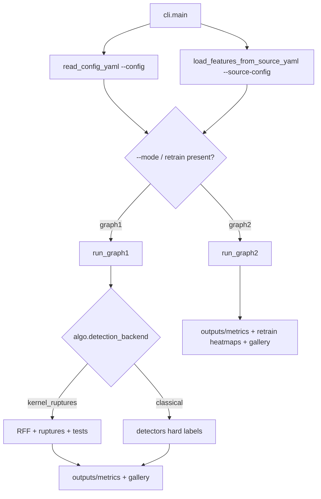
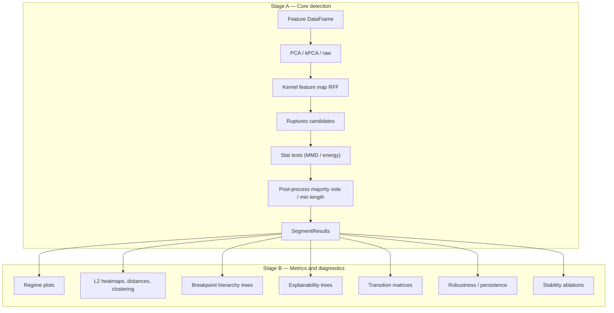
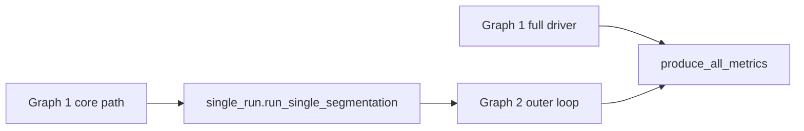

# Gulfstream

Gulfstream implements pipelines for detecting structural breaks between time series regimes. We use the example of FX and yield-curve data, but any time series dataset will work. The core data structure must be (one or more) **polars** `DataFrame` with a required `date` column (`gulfstream.common.frames`). 

Three pipeline modes share one CLI / API surface:

* **Graph 1** runs full regime detection end to end. Default backend (`algo.detection_backend: kernel_ruptures`): features → PCA/kPCA → RFF → ruptures (PELT / Binseg / BottomUp) → MMD or energy-distance tests → postprocess, then optional plots, insights, explainability, robustness, and stability. Set `detection_backend: classical` to use hard-label detectors (k-means, HDBSCAN, OPTICS, HMM, Bayesian GMM, MSAR, ruptures, Wasserstein) instead of the ruptures+MMD stack.
* **Graph 2** wraps that core in a targeted retrain loop: build an L2 heatmap, pick the worst regime and features, detect on the slice, merge breakpoints, and repeat (works with either backend).

Classical detectors also appear as **soft dimred embeddings** (`algo.dimred: [kmeans|hmm|…]`) feeding the kernel_ruptures path — orthogonal to hard-label `detection_backend: classical`.

For notebooks and scripts, prefer the **public API** in `gulfstream.api` (re-exported from `import gulfstream`): `load_features`, `detect_regimes`, `refine_regimes`, `run_single_segmentation`, `plot_regimes`, and `regime_intervals`. Pipeline internals (`run_graph1`, Hamilton drivers, etc.) remain available but are not the supported entry point.

Single-pass segmentation — shared by Graph 2 and the robustness/stability stages — and CLI feature loading are implemented as [Apache Hamilton](https://hamilton.apache.org/) dataflows under `gulfstream.pipelines.hamilton`.

## Setup

```bash
uv sync
uv pip install -e .
```

## Run

The CLI separates *what* you analyze from *how* you analyze it. A **source YAML** (`--source-config`) defines the input data; an **algo YAML** (`--config`) defines detection settings and post-run metrics. Use `--mode` to pick `graph1` or `graph2`. If you omit `--mode`, Graph 2 is selected automatically when the config contains a `retrain` section.

```bash
# Core path (deferred stages off), synthetic jump data
uv run python -m gulfstream.cli --config config/graph1/default_core.yaml --source-config config/sources/synthetic.yaml

# Full Graph 1 with different sources
uv run python -m gulfstream.cli --mode graph1 --config config/graph1/full_graph1.yaml --source-config config/sources/synthetic.yaml
uv run python -m gulfstream.cli --config config/graph1/full_graph1.yaml --source-config config/sources/parquet.yaml
uv run python -m gulfstream.cli --config config/graph1/full_graph1.yaml --source-config config/sources/duckdb_smoke.yaml
uv run python -m gulfstream.cli --config config/graph1/full_graph1.yaml --source-config config/sources/csv.yaml

# Graph 2 auto retrain (empty seed → heatmaps → merge until threshold / max_iter)
uv run python -m gulfstream.cli --config config/graph2/full_graph2.yaml --source-config config/sources/synthetic.yaml
uv run python -m gulfstream.cli --mode graph2 --config config/graph2/full_graph2.yaml --source-config config/sources/duckdb_smoke.yaml

# Graph 2 interactive (stdin prompts for regime / features)
uv run python -m gulfstream.cli --config config/graph2/graph2_interactive.yaml --source-config config/sources/synthetic.yaml

# Classical hard-label detectors (Graph 1, detection_backend: classical)
uv run python -m gulfstream.cli --mode graph1 --config config/graph1/classical_kmeans.yaml --source-config config/sources/synthetic.yaml
uv run python -m gulfstream.cli --mode graph1 --config config/graph1/classical_hdbscan.yaml --source-config config/sources/synthetic.yaml
uv run python -m gulfstream.cli --mode graph1 --config config/graph1/classical_optics.yaml --source-config config/sources/synthetic.yaml
uv run python -m gulfstream.cli --mode graph1 --config config/graph1/classical_hmm.yaml --source-config config/sources/synthetic.yaml
```

Dimred options for Graph 1 / Graph 2 configs:

| Method | Embedding emitted |
|--------|-------------------|
| `pca` / `kpca` / `raw` / `dmd` / `tsne`  | classical / manifold embeddings |
| `bayesian_gmm` | mixture responsibilities |
| `hmm` | posterior state probabilities |
| `kmeans` | distances to cluster centers |
| `hdbscan` | distances to HDBSCAN centroids (discovered ``k``) |
| `optics` | distances to OPTICS centroids (discovered ``k``) |
| `msar` | smoothed MSAR regime probabilities |
| `wasserstein` | Wasserstein distances to cluster centroids (window→series) |
| `ruptures` | distances to PELT/window/Dynp segment means |
| `tft` | TFT attention-vector embeddings (`rank` = hidden size) |

TFT needs `lightning` and `pytorch-forecasting` (both installed); Model-based dimred methods read `algo.regimes` where relevant — HDBSCAN, OPTICS, Wasserstein, and ruptures-pelt can omit it; TFT uses `rank`. Post-information regime clustering is controlled by `metrics.regime_cluster_algorithms` (`kmeans`, `hdbscan`, or `optics`; default `kmeans`).

```bash
# Graph 1 with model-based dimred
uv run python -m gulfstream.cli --mode graph1 --config config/graph1/graph1_hmm_dimred.yaml --source-config config/sources/synthetic.yaml
uv run python -m gulfstream.cli --mode graph1 --config config/graph1/graph1_kmeans_dimred.yaml --source-config config/sources/synthetic.yaml
uv run python -m gulfstream.cli --mode graph1 --config config/graph1/graph1_hdbscan_dimred.yaml --source-config config/sources/synthetic.yaml
uv run python -m gulfstream.cli --mode graph1 --config config/graph1/graph1_optics_dimred.yaml --source-config config/sources/synthetic.yaml
uv run python -m gulfstream.cli --mode graph1 --config config/graph1/graph1_ruptures_dimred.yaml --source-config config/sources/synthetic.yaml
uv run python -m gulfstream.cli --mode graph1 --config config/graph1/graph1_tft_dimred.yaml --source-config config/sources/synthetic.yaml
```

### Source types

Source configs under `config/sources/` map to the following loaders:

| `type` | Key parameters |
|--------|----------------|
| `synthetic` | `case`, `regimes`, `features`, `durations`, `regime_params`, `seed` |
| `faker` | `n_days`, `n_regimes`, `sources`, `tenors`, `fx_pairs`, `seed` |
| `parquet` | `path`, optional `create_if_missing`, `generate_features` |
| `csv` | `path`, `date_column`, optional `columns`, `sep`, `start_date`/`end_date` |
| `duckdb` | `db_path`, `rate_table`, `sources`, `tenors`, `fx_pairs`, dates |
| `sqlite` | same shape as `duckdb` |

### Tutorial notebooks

For a guided walkthrough on real DuckDB data, see [`notebooks/`](notebooks/). `01_ycs_zero_rates_workflow.ipynb` covers `zero_rates` and FX from `D:/data/duckdb/ycs_data.duckdb`; `02_equity_eod_workflow.ipynb` covers `equity_eod` from `D:/data/duckdb/equity_eod_data.duckdb`. Both use the public API (`run_single_segmentation`, `refine_regimes`, `plot_regimes`) and walk through:

| Part | Focus |
|------|--------|
| A–C | PCA / kPCA / DMD — Graph 1 + Graph 2 |
| D | Binseg / BottomUp search (`SearchMethod`) |
| E | `energy_distance` / `mmd_unbiased` tests (`StatTest`) |
| F | ESS window hyperparameter |
| G | Classical hard-label detectors (`detection_backend: classical`) + Graph 2 |
| H | Classical models as soft dimred into `kernel_ruptures` |
| I | TFT attention embeddings as dimred (+ optional Graph 2) |
| — | Comparison: covering + breakpoint F1 vs PCA baseline |

Launch instructions are in [`notebooks/README.md`](notebooks/README.md).

Run outputs land under `outputs/metrics/` and `outputs/logs/`.

---

## Workflow

A single CLI entry loads data once, then dispatches to Graph 1 or Graph 2.

### Entry call path



The split between `--source-config` and `--config` is deliberate: one file chooses the series, the other chooses the detector and which post-run metrics to emit. You can point the same algo YAML at synthetic smoke data or a DuckDB window without touching code.

---

### Graph 1 — full regime detection

Graph 1 searches for breakpoints over the full series in one parameter-grid pass, then optionally scores and explains the result.



| Stage | What it does | Why it exists |
|-------|----------------|---------------|
| **A — Core detection** | Reduce dimensions, map to a kernel feature space, propose breakpoints with ruptures (PELT / Binseg / BottomUp), accept/reject with MMD or energy distance, then clean segments. | Produce a single segmentation (`bkpts`, labels, hierarchy, stats) that is the baseline for everything else. |
| **B — Metrics** | Plot regimes, feature×regime L2 loss, regime distances/clusters, hierarchy trees, decision-tree explanations, transition probabilities; optionally perturb HPs (robustness) or drop sources/tenors/windows (stability). | Turn raw breakpoints into interpretable, stress-tested outputs under `outputs/metrics/`. |

Stage B is controlled by `metrics.plot` and by `robustness.enabled` / `stability.enabled` in YAML. `config/full_graph1.yaml` turns the deferred stages on; `default_core.yaml` keeps them off for faster smoke runs.

---

### Graph 2 — targeted retrain loop

Graph 2 does not define a separate detector. It wraps Graph 1's single-run path (`run_single_segmentation`) in an outer loop that focuses compute on poorly explained regimes.


In **auto mode** (`retrain.interactive: false`), the loop continues while the maximum L2 loss exceeds `threshold` and `iters < max_iter`. Each iteration picks the worst regime and its top-`num_worst_features`, reruns detection on that slice, merges the result, and refreshes the heatmap. The loop stops early if a slice yields no new breakpoints.

In **interactive mode** (`retrain.interactive: true`), the same steps run, but you choose the regime and features from stdin. Type `q`, `quit`, `exit`, or `stop` to finish.

| Step | Purpose |
|------|---------|
| Seed | Start from nothing or from a prior Graph 1 export (`regimes_df`). |
| Heatmap | Show which features are farthest from their regime mean (where the current partition fails). |
| Select | Decide *where* and *on which columns* to spend another detection pass. |
| Slice detect | Reuse Graph 1 core on `df.iloc[start:end][features]` only. |
| Merge | Attach the slice hierarchy with local indices, shift bkpts/stats to global time, then loop. |

Final results are built from the **merged** `processed_bkpts`, not the seed list. The driver then writes optional Excel/report output, runs `produce_all_metrics`, and generates an HTML gallery.

---

### How the two graphs relate



Graph 1 is the global search. Graph 2 is local refinement: it repeatedly calls the same single-segmentation primitive on troubled intervals until the L2 heatmap is good enough or the iteration budget is spent.

---

## Architecture

```text
gulfstream/
├── config/
│   ├── graph1/             # default_core, full_graph1, classical_*, graph1_*_dimred
│   ├── graph2/             # full_graph2, graph2_interactive
│   └── sources/            # synthetic, duckdb, parquet, csv, ...
├── src/gulfstream/
│   ├── api.py              # Public programmatic façade
│   ├── cli.py              # Entry: load configs → dispatch mode
│   ├── common/             # frames, results, utils, options (enums), config (pydantic)
│   ├── data/               # source_loader, synth, feature_generation
│   ├── pipelines/          # graph1, graph2/, classical, single_pass, _shared
│   │   └── hamilton/       # Apache Hamilton DAGs (segmentation, load_features)
│   ├── detection/          # algorithm, stat_tests, time_index, trees, hyperparams, postprocess
│   ├── dimred/             # dispatcher, classical/*, model_based/, density
│   ├── features/           # kernel_map, names
│   ├── metrics/            # evaluation, plots, insights, explainability, robustness, ...
│   └── detectors/          # kmeans, hmm, hdbscan, optics, msar, ruptures, wasserstein, tft
└── outputs/
    ├── metrics/            # PNGs, Excel, gallery.html
    └── logs/
```

### Layers

| Layer | Responsibility |
|-------|----------------|
| **API / CLI** | `gulfstream.api` for programmatic use; CLI parses `--config`, `--source-config`, `--mode` and materializes `${IMG_DIR}` / `${LOG_DIR}`. |
| **Config** | Pydantic `Config` models + `StrEnum` options (`common/config.py`, `common/options.py`). YAML keys unchanged. |
| **Data** | Build a dated feature matrix from DuckDB/SQLite, parquet/CSV, or synthetic/faker generators. No detection logic. |
| **Pipelines** | Mode orchestrators (`run_graph1` / `run_graph2`) plus classical backend helper and `single_pass`. Linear kernel core via Hamilton. |
| **Detection** | Ruptures search (PELT / Binseg / BottomUp) + MMD / energy tests + hyperparams + postprocess; or classical hard-label detectors. |
| **Dimred / features** | Classical and model-based embeddings; RFF / Nyström maps. |
| **Metrics** | Evaluation (covering, F1, recovery), heatmaps, trees, explainability, transitions, robustness, stability. |
| **Detectors** | Hard-label classical detectors (also reused as model-based dimred helpers). |
| **Outputs** | Timestamped `bkpt_tests_*` dirs under `outputs/metrics/`, plus logs under `outputs/logs/`. |

### Key result type

Runs accumulate into `SegmentResults`: breakpoints (`bkpts`), invalid breakpoints, per-bkpt stats, hierarchy, labels, and optional `persistence`, `low_confidence_bkpts`, and `stability_score` from the deferred Graph 1 stages.

### Config split

Algo configs (`config/graph1|graph2/*.yaml`) hold `algo`, `test`, `metrics`, and optional `robustness`, `stability`, `retrain`, and `log` sections. Source configs (`config/sources/*.yaml`) describe only how to load or generate the feature DataFrame. That separation lets you reuse the same detector settings across synthetic smoke data and production DuckDB extracts without code changes.

Set `algo.detection_backend: [classical]` and `algo.regime_detection_algorithm: [kmeans|hmm|…]` for hard-label Graph 1 (see `config/graph1/classical_*.yaml`). Default is `kernel_ruptures`.

### Programmatic API

Import from the package root — all functions accept a pydantic `Config` or a plain params dict (validated via `coerce_params`):

| Function | Role |
|----------|------|
| `load_features(source_yaml, project_root=…)` | Load a dated feature matrix from a source YAML |
| `detect_regimes(df, config)` | Run full Graph 1 (grid driver; may write artifacts per `metrics.mode`) |
| `run_single_segmentation(df, config)` | One Graph 1 pass in memory — used by Graph 2 and notebooks |
| `refine_regimes(df, config, seed=…)` | Run Graph 2; seed from `SegmentResults` or a `regimes_df` |
| `seed_regimes_from_results(df, results)` | Build Start/End/Regime table from Graph 1 output |
| `plot_regimes(df, results, variables=…)` | Regime-shaded feature plots |
| `regime_intervals(results, dates)` | Start/End/Regime table from breakpoint hierarchy |

Typed option enums live in `gulfstream.common.options` (`SearchMethod`, `StatTest`, `DimredMethod`, `DetectionBackend`, `ClassicalDetector`, …). YAML keys are unchanged; enums are optional in Python.

```python
from pathlib import Path

from gulfstream import (
    load_features,
    plot_regimes,
    refine_regimes,
    regime_intervals,
    run_single_segmentation,
    seed_regimes_from_results,
)
from gulfstream.common import utils
from gulfstream.common.options import SearchMethod, StatTest

root = Path(".")
params = utils.read_config_yaml(
    "config/graph1/default_core.yaml",
    img_dir=str(root / "outputs/metrics"),
    log_dir=str(root / "outputs/logs"),
)
params["test_num"] = 0  # single grid point for notebooks / quick runs

df = load_features("config/sources/synthetic.yaml", project_root=root)

# Graph 1 — fast single pass (no full grid)
res = run_single_segmentation(df, params)
regime_intervals(res, df["date"].to_list())

# Graph 1 — swap search / test knobs in Python
params_binseg = params.copy()
params_binseg["algo"] = {**params["algo"], "search_method": [SearchMethod.BINSEG]}
params_energy = params.copy()
params_energy["test"] = {**params["test"], "choice": [StatTest.ENERGY_DISTANCE]}

# Graph 2 — seed from Graph 1
g2 = utils.read_config_yaml(
    "config/graph2/full_graph2.yaml",
    img_dir=str(root / "outputs/metrics"),
    log_dir=str(root / "outputs/logs"),
)
refined = refine_regimes(df, g2, seed=res)
plot_regimes(df, refined or res, variables=["feature_0"], title="Regimes")
```

Prefer `import gulfstream` over pipeline internals (`run_graph1`, Hamilton nodes, etc.).

### Glossary

| Term | Meaning |
|------|---------|
| **bkpt / bkpts** | Breakpoint index (row) in the dated feature frame |
| **dimred** | Dimensionality reduction step before the kernel map |
| **RFF** | Random Fourier Features approximating an RBF kernel |
| **MMD** | Maximum Mean Discrepancy two-sample test |
| **energy_distance** | Distribution-free two-sample test (no kernel bandwidth) |
| **PELT / Binseg / BottomUp** | Ruptures search methods for candidate breakpoints (`algo.search_method`) |
| **detection_backend** | `kernel_ruptures` (default) or `classical` hard-label detectors |
| **classical detector** | k-means / HMM / HDBSCAN / … via `algo.regime_detection_algorithm` |
| **ESS window** | Data-driven MMD window from effective sample size (`test.window.method: ess`) |
| **covering / F1** | Breakpoint-set metrics: interval covering and precision/recall/F1 with tolerance |
| **regimes_df** | Start/End/Regime(+ hierarchy) table used to seed Graph 2 |

---

## Statistical methods

Detection is configured under `algo` (search + dimred + backend) and `test` (validation for kernel_ruptures). Evaluation metrics are in `gulfstream.metrics.evaluation`.

### Detection backend (`algo.detection_backend`)

| Backend | YAML value | Notes |
|---------|------------|-------|
| Kernel ruptures | `kernel_ruptures` | Default — RFF → ruptures → MMD/energy |
| Classical | `classical` | Hard labels from `regime_detection_algorithm` |

```yaml
algo:
  detection_backend: [classical]
  regime_detection_algorithm: [kmeans]  # hmm | hdbscan | optics | …
  regimes: [3]
```

### Search (`algo.search_method`)

| Method | YAML value | Notes |
|--------|------------|-------|
| PELT | `pelt` | Default — exact segmentation with penalty |
| Binary segmentation | `binseg` | Greedy top-down splits |
| Bottom-up | `bottomup` | Agglomerative merge of segments |

```yaml
algo:
  search_method: [binseg]   # or [bottomup]
```

### Tests (`test.choice`)

| Test | YAML value | Notes |
|------|------------|-------|
| MMD (no time series) | `mmd_no_ts` | Default |
| MMD (time series) | `mmd_ts` | Accounts for temporal structure |
| MMD (permutation) | `mmd_perm` | Permutation-based p-value |
| Unbiased MMD | `mmd_unbiased` | U-statistic MMD estimator |
| Energy distance | `energy_distance` | No RBF bandwidth; good when kernel tuning is awkward |

```yaml
test:
  choice: [energy_distance]   # or [mmd_unbiased]
```

### Window hyperparameters (`test.window`)

| Method | YAML | Notes |
|--------|------|-------|
| Fixed | `method: user_specified`, `window: 40` | Default in `default_core.yaml` |
| ESS heuristic | `method: ess`, `ess_fraction`, `min_window`, `max_window` | Scales window from effective sample size |

```yaml
test:
  window:
    - method: ess
      ess_fraction: 0.25
      min_window: 20
      max_window: 100
```

### Evaluation metrics

| Metric | Function | Use |
|--------|----------|-----|
| Recovery rate | `recovery_rate` | Fraction of true breaks recovered |
| Hausdorff distance | (internal; used in robustness/stability) | Set distance between breakpoint lists |
| Covering | `covering_metric` | Interval overlap between two segmentations |
| Breakpoint F1 | `breakpoint_precision_recall_f1` | Precision / recall / F1 with day tolerance |

Notebooks compare runs with `covering_metric` and `breakpoint_precision_recall_f1` against a PCA baseline.

### Roadmap (suggested next)

| Level | Candidates |
|-------|------------|
| Search | Wild Binary Segmentation (WBS); Bayesian Online Changepoint Detection (BOCPD) |
| Tests | Hotelling T² / multivariate CUSUM; KS on PCA scores; linear-time MMD |
| Dimred | Nelson–Siegel / dynamic factors for curves; ICA; functional PCA |
| Metrics | Adjusted Rand index between labelings |
| Legacy regimes | Jump models; sticky HDP-HMM; GARCH volatility regimes |
