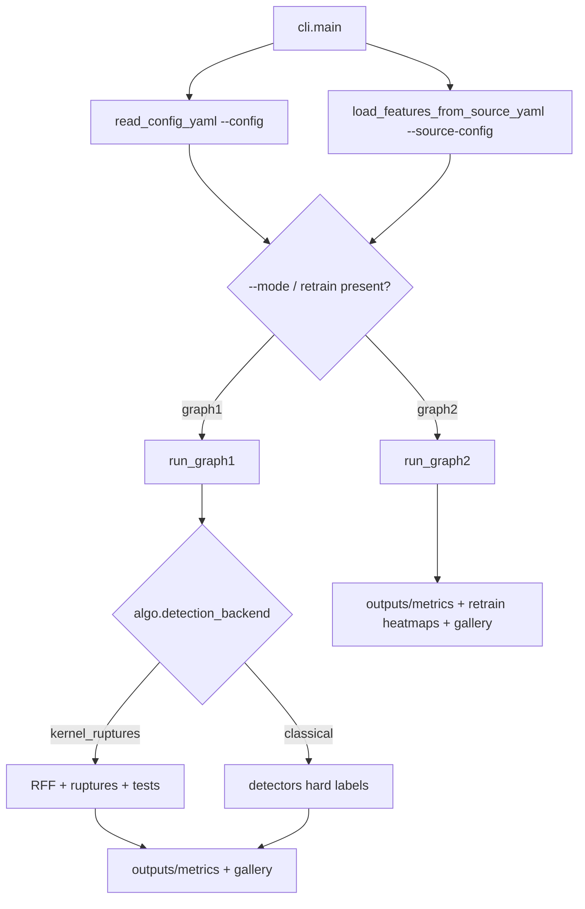
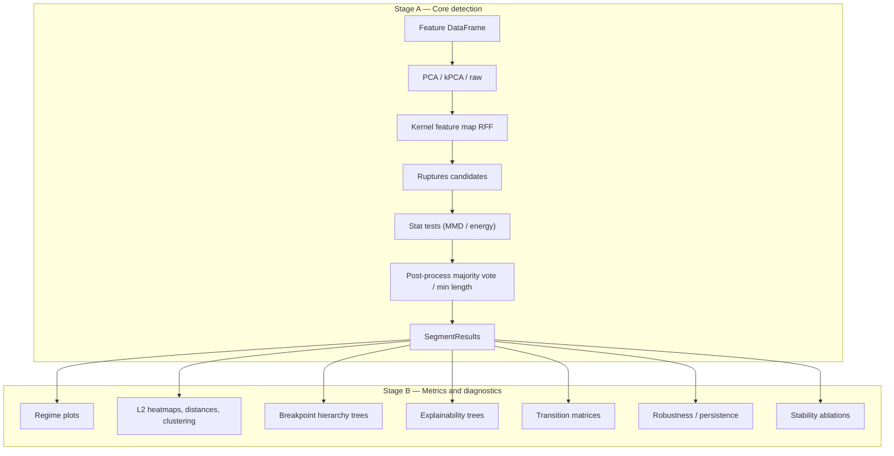

# Gulfstream

⭐ If you find this repository useful, please **consider starring it**.

Gulfstream implements pipelines for detecting structural breaks between time series regimes. We use the example of FX and yield-curve data, but any time series dataset will work. The core data structure must be (one or more) **polars** `DataFrame` with a required `date` column (`gulfstream.common.frames`; values may be Date or Datetime). 

Data can be fed in raw (leaving feature engineering to the user) or the user can supply their own feature engineering method or reuse internally available methods, see [`config/sources`](config/sources/) for examples. We also provide short-hand evaluation expressions (which can include user provided functions) for the creation of features through the use of [Panelyzer](https://github.com/FulgentMcGuffin/panelyzer), see [`notebook_ycs_panelyzer.yaml`](config/sources/notebook_ycs_panelyzer.yaml).

Two pipeline modes share one CLI / API surface (`--mode graph1|graph2`):

* **Graph 1** — one-shot regime detection over the full series. Default backend (`algo.detection_backend: kernel_ruptures`): features → PCA/kPCA/DMD → RFF → ruptures (PELT / Binseg / BottomUp / WBS / BOCPD) → MMD, energy-distance, or other `test.choice` methods → postprocess, then optional plots, insights, explainability, robustness, stability, uncertainty, Excel export, and NDJSON events. Set `detection_backend: classical` to use hard-label detectors (`ClassicalDetector`: k-means, HMM, jump model, sticky HDP-HMM, GARCH, MS-VAR, …) instead of the ruptures+MMD stack.
* **Graph 2** — iterative refinement of a Graph 1 segmentation: build a feature×regime score heatmap (`retrain.score_method`, default L2), pick the worst regime and features, re-run detection on that slice, merge breakpoints, and repeat until the score is below `threshold` or `max_iter` is hit (works with either backend).

Classical detectors also appear as **soft dimred embeddings** (`algo.dimred: [kmeans|hmm|…]`) feeding the kernel_ruptures path — orthogonal to hard-label `detection_backend: classical`.

For notebooks and scripts, prefer the **public API** in `gulfstream.api` (re-exported from `import gulfstream`): `load_features`, `detect_regimes`, `detect_regimes_incremental`, `detect_regimes_panel`, `refine_regimes`, `run_single_segmentation`, `plot_regimes`, and `regime_intervals`. Pipeline internals (`run_graph1`, Hamilton drivers, etc.) remain available but are not the supported entry point.

Single-pass segmentation — shared by Graph 2 and the robustness/stability stages — and CLI feature loading are implemented as [Apache Hamilton](https://hamilton.apache.org/) dataflows under `gulfstream.pipelines.hamilton`.

## Setup

```bash
uv sync
```

## Run

The CLI separates *what* you analyze from *how* you analyze it. A **source YAML** (`--source-config`) defines the input data; an **algo YAML** (`--config`) defines detection settings and post-run metrics. Use `--mode` to pick `graph1` or `graph2`. If you omit `--mode`, Graph 2 is selected automatically when the config contains a `retrain` section.

```bash
# Core path (deferred stages off), synthetic jump data
uv run python -m gulfstream.cli --config config/graph1/default_core.yaml --source-config config/sources/synthetic.yaml

# Full Graph 1 with different sources
uv run python -m gulfstream.cli --mode graph1 --config config/graph1/full_graph1.yaml --source-config config/sources/synthetic.yaml
uv run python -m gulfstream.cli --config config/graph1/full_graph1.yaml --source-config config/sources/parquet.yaml
uv run python -m gulfstream.cli --config config/graph1/full_graph1.yaml --source-config config/sources/duckdb_smoke.yaml
uv run python -m gulfstream.cli --config config/graph1/full_graph1.yaml --source-config config/sources/csv.yaml

# Graph 2 auto retrain (empty seed → heatmaps → merge until threshold / max_iter)
uv run python -m gulfstream.cli --config config/graph2/full_graph2.yaml --source-config config/sources/synthetic.yaml
uv run python -m gulfstream.cli --mode graph2 --config config/graph2/full_graph2.yaml --source-config config/sources/duckdb_smoke.yaml
uv run python -m gulfstream.cli --mode graph2 --config config/graph2/graph2_score_diff.yaml --source-config config/sources/synthetic.yaml
uv run python -m gulfstream.cli --mode graph2 --config config/graph2/graph2_score_factor.yaml --source-config config/sources/synthetic.yaml
uv run python -m gulfstream.cli --mode graph2 --config config/graph2/graph2_score_energy.yaml --source-config config/sources/synthetic.yaml
uv run python -m gulfstream.cli --mode graph2 --config config/graph2/graph2_score_mmd.yaml --source-config config/sources/synthetic.yaml

# Graph 2 interactive (stdin prompts for regime / features)
uv run python -m gulfstream.cli --config config/graph2/graph2_interactive.yaml --source-config config/sources/synthetic.yaml

# Classical hard-label detectors (Graph 1, detection_backend: classical)
uv run python -m gulfstream.cli --mode graph1 --config config/graph1/classical_kmeans.yaml --source-config config/sources/synthetic.yaml
uv run python -m gulfstream.cli --mode graph1 --config config/graph1/classical_hdbscan.yaml --source-config config/sources/synthetic.yaml
uv run python -m gulfstream.cli --mode graph1 --config config/graph1/classical_optics.yaml --source-config config/sources/synthetic.yaml
uv run python -m gulfstream.cli --mode graph1 --config config/graph1/classical_hmm.yaml --source-config config/sources/synthetic.yaml
uv run python -m gulfstream.cli --mode graph1 --config config/graph1/classical_jump_model.yaml --source-config config/sources/synthetic.yaml
uv run python -m gulfstream.cli --mode graph1 --config config/graph1/classical_sticky_hdp_hmm.yaml --source-config config/sources/synthetic.yaml
uv run python -m gulfstream.cli --mode graph1 --config config/graph1/classical_garch.yaml --source-config config/sources/synthetic.yaml
uv run python -m gulfstream.cli --mode graph1 --config config/graph1/classical_ms_var.yaml --source-config config/sources/synthetic.yaml
uv run python -m gulfstream.cli --mode graph1 --config config/graph1/classical_stochastic_vol.yaml --source-config config/sources/synthetic.yaml
uv run python -m gulfstream.cli --mode graph1 --config config/graph1/classical_change_in_covariance.yaml --source-config config/sources/synthetic.yaml

# Product: streaming / panel joint / uncertainty / export+events
uv run python -m gulfstream.cli --mode graph1 --config config/graph1/graph1_streaming_expanding.yaml --source-config config/sources/synthetic.yaml
uv run python -m gulfstream.cli --mode graph1 --config config/graph1/graph1_panel_joint.yaml --source-config config/sources/synthetic.yaml
uv run python -m gulfstream.cli --mode graph1 --config config/graph1/graph1_panel_joint.yaml --source-config config/sources/faker.yaml
uv run python -m gulfstream.cli --mode graph1 --config config/graph1/graph1_uncertainty_bands.yaml --source-config config/sources/synthetic.yaml
uv run python -m gulfstream.cli --mode graph1 --config config/graph1/graph1_export_events.yaml --source-config config/sources/synthetic.yaml

# Alternate candidate search (WBS / BOCPD)
uv run python -m gulfstream.cli --mode graph1 --config config/graph1/graph1_wbs_search.yaml --source-config config/sources/synthetic.yaml
uv run python -m gulfstream.cli --mode graph1 --config config/graph1/graph1_bocpd_search.yaml --source-config config/sources/synthetic.yaml
```

Dimred options for Graph 1 / Graph 2 configs:

| Method | Embedding emitted |
|--------|-------------------|
| `pca` / `kpca` / `raw` / `dmd` / `tsne` / `umap` | classical / manifold embeddings |
| `ica` | FastICA independent components (`rank`) |
| `fpca` | functional PCA (smooth along feature axis, then PCA) |
| `nelson_siegel` | Nelson–Siegel β0/β1/β2 (level/slope/curvature) per date |
| `diebold_li` | Diebold–Li — NS with per-date λ grid search |
| `dynamic_factor` | statsmodels DynamicFactor scores (PCA fallback) |
| `sparse_pca` | sklearn SparsePCA components (`rank`, `sparse_pca_alpha`) |
| `robust_pca` | GoDec-style robust PCA scores (`rank`) |
| `autoencoder` | torch MLP autoencoder latents (`rank`, `ae_epochs`) |
| `bayesian_gmm` | mixture responsibilities |
| `hmm` | posterior state probabilities |
| `kmeans` | distances to cluster centers |
| `hdbscan` | distances to HDBSCAN centroids (discovered ``k``) |
| `optics` | distances to OPTICS centroids (discovered ``k``) |
| `msar` | smoothed MSAR regime probabilities |
| `wasserstein` | Wasserstein distances to cluster centroids (window→series) |
| `ruptures` | distances to PELT/window/Dynp segment means |
| `tft` | TFT attention-vector embeddings (`rank` = hidden size) |

TFT needs `lightning` and `pytorch-forecasting` (both installed); Model-based dimred methods read `algo.regimes` where relevant — HDBSCAN, OPTICS, Wasserstein, and ruptures-pelt can omit it; TFT uses `rank`. Curve-oriented methods: `nelson_siegel` / `fpca` / `dynamic_factor` treat feature columns as an ordered tenor grid when possible. Post-information regime clustering is controlled by `metrics.regime_cluster_algorithms` (`kmeans`, `hdbscan`, or `optics`; default `kmeans`).

```bash
# Graph 1 with model-based dimred
uv run python -m gulfstream.cli --mode graph1 --config config/graph1/graph1_hmm_dimred.yaml --source-config config/sources/synthetic.yaml
uv run python -m gulfstream.cli --mode graph1 --config config/graph1/graph1_kmeans_dimred.yaml --source-config config/sources/synthetic.yaml
uv run python -m gulfstream.cli --mode graph1 --config config/graph1/graph1_hdbscan_dimred.yaml --source-config config/sources/synthetic.yaml
uv run python -m gulfstream.cli --mode graph1 --config config/graph1/graph1_optics_dimred.yaml --source-config config/sources/synthetic.yaml
uv run python -m gulfstream.cli --mode graph1 --config config/graph1/graph1_ruptures_dimred.yaml --source-config config/sources/synthetic.yaml
uv run python -m gulfstream.cli --mode graph1 --config config/graph1/graph1_tft_dimred.yaml --source-config config/sources/synthetic.yaml

# Graph 1 with curve / ICA dimred
uv run python -m gulfstream.cli --mode graph1 --config config/graph1/graph1_ica_dimred.yaml --source-config config/sources/synthetic.yaml
uv run python -m gulfstream.cli --mode graph1 --config config/graph1/graph1_fpca_dimred.yaml --source-config config/sources/synthetic.yaml
uv run python -m gulfstream.cli --mode graph1 --config config/graph1/graph1_nelson_siegel_dimred.yaml --source-config config/sources/synthetic.yaml
uv run python -m gulfstream.cli --mode graph1 --config config/graph1/graph1_dynamic_factor_dimred.yaml --source-config config/sources/synthetic.yaml
uv run python -m gulfstream.cli --mode graph1 --config config/graph1/graph1_diebold_li_dimred.yaml --source-config config/sources/synthetic.yaml
uv run python -m gulfstream.cli --mode graph1 --config config/graph1/graph1_sparse_pca_dimred.yaml --source-config config/sources/synthetic.yaml
uv run python -m gulfstream.cli --mode graph1 --config config/graph1/graph1_robust_pca_dimred.yaml --source-config config/sources/synthetic.yaml
uv run python -m gulfstream.cli --mode graph1 --config config/graph1/graph1_autoencoder_dimred.yaml --source-config config/sources/synthetic.yaml
```

### Source types

Source configs under `config/sources/` map to the following loaders:

| `type` | Key parameters |
|--------|----------------|
| `synthetic` | `case`, `regimes`, `features`, `durations`, `regime_params`, `seed` |
| `faker` | `kind` (`yields` default, or `hmm_panel`), `n_days` / `n_years`, `n_features`, `n_regimes`, `n_repeating`, `seed`, optional yield `sources`/`tenors`/`fx_pairs`; optional `generate_features` + `feature_generator` / `feature_generator_kwargs` (yields only) |
| `parquet` | `path`, optional `create_if_missing`, `create_kind` (`faker_yields` \| `jump` \| `hmm_panel`); optional `generate_features` + `feature_generator` / kwargs |
| `csv` | `path`, `date_column`, optional `columns`, `sep`, `start_date`/`end_date`; optional `generate_features` + `feature_generator` / kwargs |
| `duckdb` | `db_path`, `rate_table`, `sources`, `tenors`, `fx_pairs`, dates; optional `generate_features` + `feature_generator` / `feature_generator_kwargs` |
| `sqlite` | same shape as `duckdb` |

When `generate_features` is true (or auto-enabled for rate/FX-style frames that do not already look like `f0`/`f1`/… columns), set `feature_generator` to a dotted callable path such as `gulfstream.data.feature_generation.generate_yield_features`. Pass non-default arguments under `feature_generator_kwargs`. Built-ins also include `identity_features`, `generate_ewma_features`, and `generate_panelyzer_features` (delegates to [panelyzer](https://github.com/FulgentMcGuffin/panelyzer) `feature_builder.create_features` with caching forced off; see [`config/features/ycs_panelyzer_subset.yaml`](config/features/ycs_panelyzer_subset.yaml)).

### Tutorial notebooks

For guided walkthroughs, see [`notebooks/`](notebooks/). `01` / `02` use user-supplied yield-curve+FX or equity DuckDB data; `03` / `04` use a Faker HMM panel (in-memory or parquet); `05` uses the YCS DuckDB window with **panelyzer** expressions (**Parts A–B only**). Notebooks `01`–`04` walk the public API through the parts below (`05` stops after B):

| Part | Focus |
|------|--------|
| A–C | PCA / kPCA / DMD — Graph 1 + Graph 2 |
| D | Search methods (`SearchMethod`: PELT / Binseg / BottomUp / WBS / BOCPD) |
| E | Statistical tests (`StatTest`: energy / MMD / Hotelling / CUSUM / …) |
| F | ESS window hyperparameter |
| G | Classical hard-label detectors (`detection_backend: classical`) + Graph 2 |
| H | Classical models as soft dimred into `kernel_ruptures` |
| I | TFT attention embeddings as dimred (+ optional Graph 2) |
| J | Curve / ICA dimred (`nelson_siegel`, `fpca`, `dynamic_factor`, `ica`) |
| K | Product: uncertainty + CI ribbons, Excel export, NDJSON events, streaming, panel |
| L | Graph 2 retrain scores (`retrain.score_method`: `mse_on_diff`, `factor_residual`, `energy_split`, `mmd_split`, …) |
| — | Comparison: covering + adjusted Rand index + breakpoint F1 (vs PCA; synthetic notebooks also vs ground truth) |

Launch instructions and matching example YAMLs are in [`notebooks/README.md`](notebooks/README.md). Notebook artifacts land under `outputs/notebooks/{ycs,equity,faker_hmm,parquet_hmm,ycs_panelyzer}/` (Part K → `…/product/`, Part L → `…/graph2_scores/`).

CLI / pipeline run outputs land under `outputs/metrics/` and `outputs/logs/`.

---

## Workflow

A single CLI entry loads data once, then dispatches to Graph 1 or Graph 2.

### Entry call path



The split between `--source-config` and `--config` is deliberate: one file chooses the series, the other chooses the detector and which post-run metrics to emit. You can point the same algo YAML at synthetic smoke data or a DuckDB window without touching code.

---

### Graph 1 — full regime detection

Graph 1 searches for breakpoints over the full series in one parameter-grid pass, then optionally scores and explains the result.



| Stage | What it does | Why it exists |
|-------|----------------|---------------|
| **A — Core detection** | Reduce dimensions, map to a kernel feature space, propose breakpoints with ruptures (PELT / Binseg / BottomUp / WBS / BOCPD), accept/reject with `test.choice` (MMD / energy / …), then clean segments. | Produce a single segmentation (`bkpts`, labels, hierarchy, stats) that is the baseline for everything else. |
| **B — Metrics** | Plot regimes (optional CI ribbons), feature×regime insights, regime distances/clusters, hierarchy trees, decision-tree explanations, transition probabilities; optionally perturb HPs (robustness) or drop sources/tenors/windows (stability); optional Excel / NDJSON export. | Turn raw breakpoints into interpretable, stress-tested outputs under `outputs/metrics/`. |

Stage B is controlled by `metrics.plot` and by `robustness.enabled` / `stability.enabled` in YAML. `config/graph1/full_graph1.yaml` turns the deferred stages on; `default_core.yaml` keeps them off for faster smoke runs. Excel (`export.excel`) and NDJSON events (`events`) are written from `produce_all_metrics` even when plotting is off.

---

### Graph 2 — targeted retrain loop

Graph 2 does not define a separate detector. It wraps Graph 1's single-run path (`run_single_segmentation`) in an outer loop that focuses compute on poorly explained regimes.


In **auto mode** (`retrain.interactive: false`), the loop continues while the maximum heatmap cell exceeds `threshold` and `iters < max_iter`. Each iteration picks the worst regime and its top-`num_worst_features`, reruns detection on that slice, merges the result, and refreshes the heatmap. The loop stops early if a slice yields no new breakpoints.

In **interactive mode** (`retrain.interactive: true`), the same steps run, but you choose the regime and features from stdin. Type `q`, `quit`, `exit`, or `stop` to finish.

#### Retrain score methods (`retrain.score_method`)

The heatmap is a pluggable **feature × regime** score (higher = refine first). Default `mse_to_mean` is the legacy L2-to-regime-mean matrix. **`threshold` is in the chosen score’s units** — retune when switching methods. Method-specific knobs go under `retrain.score`.

| `score_method` | Measures | Good for |
|----------------|----------|----------|
| `mse_to_mean` (default) | Mean sq. residual to regime mean | Baseline / levels |
| `mad_to_median` | Mean abs. residual to regime median | Outliers / jumps |
| `mse_on_diff` | MSE on first differences (`score.diff_order`) | Drifting rates / log-prices |
| `factor_residual` | Within-regime PCA residual (`score.n_components`) | Panel co-movement (tenors / tickers) |
| `hotelling_within` | Half-vs-half standardized mean-shift² | Multivariate mean leftovers |
| `cusum_intensity` | Max \|CUSUM\| per feature (`score.cusum_k`) | Remaining change evidence |
| `energy_split` | Max mid-window energy distance per feature | Kernel-aligned; remaining breaks |
| `mmd_split` | Max mid-window RBF-MMD² per feature | Closest to Graph 1 MMD tests |

```yaml
retrain:
  score_method: mse_on_diff
  score: { diff_order: 1 }
  threshold: 0.01
  num_worst_features: 5
  max_iter: 10
```

Split scorers (`energy_split` / `mmd_split`) accept smoke-friendly knobs under `retrain.score`: `n_splits`, `min_side`, `max_rows`; MMD also supports `mmd_estimator` (`linear` | `biased` | `unbiased`) and optional fixed `gamma`.

Example configs: `config/graph2/full_graph2.yaml` (default L2), `graph2_score_diff.yaml`, `graph2_score_factor.yaml`, `graph2_score_energy.yaml`, `graph2_score_mmd.yaml`.

| Step | Purpose |
|------|---------|
| Seed | Start from nothing or from a prior Graph 1 export (`regimes_df`). |
| Heatmap | Score which features / regimes look poorly explained under `score_method`. |
| Select | Decide *where* and *on which columns* to spend another detection pass. |
| Slice detect | Reuse Graph 1 core on the selected time slice and feature subset only. |
| Merge | Attach the slice hierarchy with local indices, shift bkpts/stats to global time, then loop. |

Final results are built from the **merged** `processed_bkpts`, not the seed list. The driver then writes optional Excel/report output, runs `produce_all_metrics`, and generates an HTML gallery.

---

### How the two graphs relate


Graph 1 is the global search. Graph 2 is local refinement: it repeatedly calls the same single-segmentation primitive on troubled intervals until the retrain heatmap is good enough or the iteration budget is spent.

---

## Architecture

```text
gulfstream/
├── config/
│   ├── graph1/             # default_core, full_graph1, classical_*, streaming/panel/export, …
│   ├── graph2/             # full_graph2, graph2_score_*, interactive
│   ├── features/           # panelyzer expression YAMLs (e.g. ycs_panelyzer_subset)
│   └── sources/            # synthetic, duckdb, parquet, csv, notebook_*, …
├── src/gulfstream/
│   ├── api.py              # Public programmatic façade
│   ├── cli.py              # Entry: load configs → dispatch mode
│   ├── common/             # frames, results, utils, options (enums), config (pydantic)
│   ├── data/               # source_loader, synth, feature_generation
│   ├── pipelines/          # graph1, graph2/, classical, single_pass, streaming, panel, _shared
│   │   └── hamilton/       # Apache Hamilton DAGs (segmentation, load_features)
│   ├── detection/          # algorithm, stat_tests, time_index, trees, hyperparams, postprocess
│   ├── dimred/             # dispatcher, classical/*, model_based/, density
│   ├── features/           # kernel_map, names
│   ├── metrics/            # evaluation, plots, regime_scores, writers, uncertainty, …
│   ├── ops/                # NDJSON run-event stream
│   └── detectors/          # kmeans, hmm, jump_model, sticky_hdp_hmm, garch, …
└── outputs/
    ├── metrics/            # PNGs, Excel, gallery.html
    ├── notebooks/          # Tutorial notebook artifacts
    └── logs/
```

### Layers

| Layer | Responsibility |
|-------|----------------|
| **API / CLI** | `gulfstream.api` for programmatic use; CLI parses `--config`, `--source-config`, `--mode` and materializes `${IMG_DIR}` / `${LOG_DIR}`. |
| **Config** | Pydantic `Config` models + `StrEnum` options (`common/config.py`, `common/options.py`). YAML keys unchanged. |
| **Data** | Build a dated feature matrix from DuckDB/SQLite, parquet/CSV, or synthetic/faker generators. No detection logic. |
| **Pipelines** | Mode orchestrators (`run_graph1` / `run_graph2`) plus classical backend helper, `single_pass`, streaming, and panel joint. Linear kernel core via Hamilton. |
| **Detection** | Ruptures search (PELT / Binseg / BottomUp / WBS / BOCPD) + `test.choice` validation + hyperparams + postprocess; or classical hard-label detectors. |
| **Dimred / features** | Classical and model-based embeddings; RFF / Nyström maps. |
| **Metrics** | Evaluation (covering, F1, ARI, …), plots (incl. CI ribbons), Graph 2 `regime_scores`, Excel writers, uncertainty, robustness, stability. |
| **Ops** | NDJSON event stream for dashboards (`ops.events`). |
| **Detectors** | Hard-label classical detectors (also reused as model-based dimred helpers). |
| **Outputs** | Timestamped `bkpt_tests_*` dirs under `outputs/metrics/`, notebook runs under `outputs/notebooks/`, logs under `outputs/logs/`. |

### Key result type

Runs accumulate into `SegmentResults`: breakpoints (`bkpts`), invalid breakpoints, per-bkpt stats, hierarchy, labels, and optional `persistence`, `low_confidence_bkpts`, `stability_score`, `bkpt_ci`, and `panel_support` from deferred / product stages.

### Config split

Algo configs (`config/graph1|graph2/*.yaml`) hold `algo`, `test`, `metrics`, and optional `robustness`, `stability`, `uncertainty`, `export`, `events`, `streaming`, `panel`, `retrain`, and `log` sections. Source configs (`config/sources/*.yaml`) describe only how to load or generate the feature DataFrame. That separation lets you reuse the same detector settings across synthetic smoke data and production DuckDB extracts without code changes.

Set `algo.detection_backend: [classical]` and `algo.regime_detection_algorithm: [kmeans|hmm|…]` for hard-label Graph 1 (see `config/graph1/classical_*.yaml`). Default is `kernel_ruptures`.

### Programmatic API

Import from the package root — all functions accept a pydantic `Config` or a plain params dict (validated via `coerce_params`):

| Function | Role |
|----------|------|
| `load_features(source_yaml, project_root=…)` | Load a dated feature matrix from a source YAML |
| `detect_regimes(df, config)` | Run full Graph 1 (grid driver; may write artifacts per `metrics.mode`) |
| `detect_regimes_incremental(df, config, state=…)` | One streaming Graph 1 step (expanding / rolling) |
| `detect_regimes_panel(df, config)` | Per-group Graph 1 → consensus breakpoints (`panel_support`) |
| `run_single_segmentation(df, config)` | One Graph 1 pass in memory — used by Graph 2 and notebooks |
| `refine_regimes(df, config, seed=…)` | Run Graph 2; seed from `SegmentResults` or a `regimes_df` |
| `seed_regimes_from_results(df, results)` | Build Start/End/Regime table from Graph 1 output |
| `plot_regimes(df, results, variables=…)` | Regime-shaded feature plots (optional CI ribbons from `bkpt_ci`) |
| `regime_intervals(results, dates)` | Start/End/Regime table from breakpoint hierarchy |

Typed option enums live in `gulfstream.common.options` (`SearchMethod`, `StatTest`, `DimredMethod`, `DetectionBackend`, `ClassicalDetector`, `RetrainScoreMethod`, …). YAML keys are unchanged; enums are optional in Python.

```python
from pathlib import Path

from gulfstream import (
    load_features,
    plot_regimes,
    refine_regimes,
    regime_intervals,
    run_single_segmentation,
    seed_regimes_from_results,
)
from gulfstream.common import utils
from gulfstream.common.options import SearchMethod, StatTest

root = Path(".")
params = utils.read_config_yaml(
    "config/graph1/default_core.yaml",
    img_dir=str(root / "outputs/metrics"),
    log_dir=str(root / "outputs/logs"),
)
params["test_num"] = 0  # single grid point for notebooks / quick runs

df = load_features("config/sources/synthetic.yaml", project_root=root)

# Graph 1 — fast single pass (no full grid)
res = run_single_segmentation(df, params)
regime_intervals(res, df["date"].to_list())

# Graph 1 — swap search / test knobs in Python
params_binseg = params.copy()
params_binseg["algo"] = {**params["algo"], "search_method": [SearchMethod.BINSEG]}
params_energy = params.copy()
params_energy["test"] = {**params["test"], "choice": [StatTest.ENERGY_DISTANCE]}

# Graph 2 — seed from Graph 1
g2 = utils.read_config_yaml(
    "config/graph2/full_graph2.yaml",
    img_dir=str(root / "outputs/metrics"),
    log_dir=str(root / "outputs/logs"),
)
refined = refine_regimes(df, g2, seed=res)
plot_regimes(df, refined or res, variables=["feature_0"], title="Regimes")
```

Prefer `import gulfstream` over pipeline internals (`run_graph1`, Hamilton nodes, etc.).

### Glossary

| Term | Meaning |
|------|---------|
| **bkpt / bkpts** | Breakpoint index (row) in the dated feature frame |
| **dimred** | Dimensionality reduction step before the kernel map |
| **RFF** | Random Fourier Features approximating an RBF kernel |
| **MMD** | Maximum Mean Discrepancy two-sample test |
| **energy_distance** | Distribution-free two-sample test (no kernel bandwidth) |
| **hotelling_t2 / multivariate_cusum / ks_pca** | Parametric / score-based breakpoint tests (`test.choice`) |
| **mmd_linear** | Gretton linear-time MMD² estimator |
| **PELT / Binseg / BottomUp / WBS / BOCPD** | Candidate breakpoint search (`algo.search_method`) |
| **detection_backend** | `kernel_ruptures` (default) or `classical` hard-label detectors |
| **classical detector** | Hard-label method via `algo.regime_detection_algorithm` (k-means, HMM, jump_model, sticky_hdp_hmm, garch, …) |
| **ESS window** | Data-driven MMD window from effective sample size (`test.window.method: ess`) |
| **streaming** | Expanding/rolling incremental Graph 1 (`streaming.enabled`) |
| **panel joint** | Consensus breakpoints across series groups (`panel.enabled`) |
| **bkpt_ci** | Calibrated index uncertainty band per breakpoint (`uncertainty.enabled`) |
| **panel_support** | Fraction of panel groups agreeing on a consensus break (`panel.enabled`) |
| **score_method** | Graph 2 feature×regime heatmap scorer (`retrain.score_method`) |
| **covering / F1 / ARI** | Breakpoint-set metrics: interval covering, precision/recall/F1, adjusted Rand index |
| **regimes_df** | Start/End/Regime(+ hierarchy) table used to seed Graph 2 |

---

## Statistical methods

Detection is configured under `algo` (search + dimred + backend) and `test` (validation for kernel_ruptures). Evaluation metrics are in `gulfstream.metrics.evaluation`.

### Detection backend (`algo.detection_backend`)

| Backend | YAML value | Notes |
|---------|------------|-------|
| Kernel ruptures | `kernel_ruptures` | Default — RFF → ruptures → MMD/energy |
| Classical | `classical` | Hard labels from `regime_detection_algorithm` |

```yaml
algo:
  detection_backend: [classical]
  regime_detection_algorithm: [kmeans]  # hmm | hdbscan | optics | jump_model | …
  regimes: [3]
```

### Classical regime detectors (`algo.regime_detection_algorithm`)

Hard-label path (`detection_backend: classical`). Each emits labels → breakpoints.

| Detector | YAML value | Notes |
|----------|------------|-------|
| k-means | `kmeans` | Clustering on the feature matrix |
| HMM | `hmm` | Gaussian HMM (`hmm_emissions`, `regimes`) |
| Bayesian GMM | `bayesian_gmm` | Dirichlet-process mixture responsibilities → labels |
| HDBSCAN / OPTICS | `hdbscan` / `optics` | Density clustering |
| MSAR | `msar` | Markov-switching AR on PC1 |
| Ruptures / Wasserstein | `ruptures` / `wasserstein` | Segmentation / OT clustering |
| Jump model | `jump_model` | Temporal clustering + jump penalty λ |
| Sticky HDP-HMM | `sticky_hdp_hmm` | Truncated sticky HDP-HMM (Fox κ) |
| GARCH vol regimes | `garch` | GARCH(1,1) σ̂_t → volatility regimes |
| MS-VAR | `ms_var` | Regime-switching VAR via HMM on lagged PCs |
| Stochastic vol | `stochastic_vol` | EWMA / realised-vol proxy → vol regimes |
| Change-in-covariance | `change_in_covariance` | Rolling corr/cov path → loading/cov breaks |

```yaml
# examples
algo:
  detection_backend: [classical]
  regime_detection_algorithm: [jump_model]
  regimes: [3]
  jump_penalty: [5.0]

algo:
  detection_backend: [classical]
  regime_detection_algorithm: [ms_var]
  regimes: [2]
  ms_var_lags: [1]
  ms_var_n_pc: [3]

algo:
  detection_backend: [classical]
  regime_detection_algorithm: [stochastic_vol]
  regimes: [2]
  sv_window: [20]

algo:
  detection_backend: [classical]
  regime_detection_algorithm: [change_in_covariance]
  regimes: [2]
  cic_window: [40]
```

Configs: `config/graph1/classical_*.yaml`.

### Search (`algo.search_method`)

| Method | YAML value | Notes |
|--------|------------|-------|
| PELT | `pelt` | Default — exact segmentation with penalty |
| Binary segmentation | `binseg` | Greedy top-down splits |
| Bottom-up | `bottomup` | Agglomerative merge of segments |
| Wild Binary Segmentation | `wbs` | Fryzlewicz WBS — random-interval CUSUM (good for close breaks) |
| Bayesian Online CPD | `bocpd` | Adams–MacKay online run-length posterior peaks |

```yaml
algo:
  search_method: [wbs]       # or [bocpd] | [binseg] | [bottomup]
  wbs_n_intervals: [200]     # WBS only
  random_state: [42]
  # bocpd_hazard: [0.01]     # BOCPD only — expected run length ≈ 1/hazard
  # bocpd_threshold: [0.4]   # posterior mass on run length 0
  # bocpd_max_run: [200]     # truncate run-length support
```

Configs: `config/graph1/graph1_wbs_search.yaml`, `config/graph1/graph1_bocpd_search.yaml`.

### Tests (`test.choice`)

| Test | YAML value | Notes |
|------|------------|-------|
| MMD (no time series) | `mmd_no_ts` | Default |
| MMD (time series) | `mmd_ts` | Accounts for temporal structure |
| MMD (permutation) | `mmd_perm` | Permutation-based p-value |
| Unbiased MMD | `mmd_unbiased` | U-statistic MMD estimator |
| Linear-time MMD | `mmd_linear` | Gretton O(n) paired MMD² |
| Energy distance | `energy_distance` | No RBF bandwidth; good when kernel tuning is awkward |
| Hotelling T² | `hotelling_t2` | Two-sample mean test (auto-PCA if high-dim) |
| Multivariate CUSUM | `multivariate_cusum` | Crosier MCUSUM of whitened residuals |
| KS on PCA scores | `ks_pca` | Kolmogorov–Smirnov on leading pooled PCA scores |

```yaml
test:
  choice: [hotelling_t2]   # or [ks_pca] | [multivariate_cusum] | [mmd_linear]
```

Hotelling / CUSUM / KS-PCA automatically project to a few PCs when the feature
map is high-dimensional relative to the window size (e.g. default RFF).

### Window hyperparameters (`test.window`)

| Method | YAML | Notes |
|--------|------|-------|
| Fixed | `method: user_specified`, `window: 40` | Default in `default_core.yaml` |
| ESS heuristic | `method: ess`, `ess_fraction`, `min_window`, `max_window` | Scales window from effective sample size |

```yaml
test:
  window:
    - method: ess
      ess_fraction: 0.25
      min_window: 20
      max_window: 100
```

### Evaluation metrics

| Metric | Function | Use |
|--------|----------|-----|
| Recovery rate | `recovery_rate` | Fraction of true breaks recovered |
| Hausdorff distance | (internal; used in robustness/stability) | Set distance between breakpoint lists |
| Covering | `covering_metric` | Interval overlap between two segmentations |
| Breakpoint F1 | `breakpoint_precision_recall_f1` | Precision / recall / F1 with day tolerance |
| Adjusted Rand index | `adjusted_rand_index` / `adjusted_rand_index_labels` | Agreement between two labelings (bkpts→labels or raw labels) |
| V-measure / NMI | `v_measure` / `normalized_mutual_info` (+ `_labels`) | Homogeneity/completeness and normalised MI |
| Temporal Hamming | `temporal_hamming` / `temporal_hamming_labels` | Annotation error after optimal label permutation |
| FDR on candidates | `fdr_control_breakpoints` | Benjamini–Hochberg keep/reject over breakpoint p-values |

```python
from gulfstream.metrics.evaluation import (
    adjusted_rand_index,
    adjusted_rand_index_labels,
    fdr_control_breakpoints,
    normalized_mutual_info,
    temporal_hamming,
    v_measure,
)

ari = adjusted_rand_index(baseline.bkpts, other.bkpts, length=n)
vm = v_measure(baseline.bkpts, other.bkpts, n)["v_measure"]
nmi = normalized_mutual_info(baseline.bkpts, other.bkpts, n)
ham = temporal_hamming(baseline.bkpts, other.bkpts, n)["annotation_error"]
fdr = fdr_control_breakpoints(candidates, pvalues, alpha=0.05)
```

Notebooks compare runs with `covering_metric`, `breakpoint_precision_recall_f1`, and `adjusted_rand_index` (vs a PCA baseline; synthetic HMM notebooks also score against ground-truth breaks).

### Product features

| Feature | Config / API | Notes |
|---------|--------------|-------|
| Streaming Graph 1 | `streaming.enabled` / `detect_regimes_incremental` | Expanding or rolling windows; optional `lock_prefix` for confirmed breaks |
| Panel joint breakpoints | `panel.enabled` / `detect_regimes_panel` | Per-group segmentation → majority / intersection / union consensus; `panel_support` |
| Uncertainty bands | `uncertainty.enabled` → `SegmentResults.bkpt_ci` | Percentile bands from robustness HP ensembles + block bootstrap |
| CI ribbon overlays | `metrics.plot_ci_ribbons` (default true) | Shaded index bands on regime plots from `bkpt_ci` |
| Excel export | `export.excel` | Breakpoints / CI / PanelSupport / Meta sheets; optional `path` or `dir`+`filename` |
| JSON event stream | `events` | NDJSON lines (`run_started`, `breakpoint_confirmed`, `run_complete`, …) |

```yaml
streaming:
  enabled: true
  mode: expanding   # or rolling
  step: 80
  min_history: 200
  lock_prefix: true

panel:
  enabled: true
  groupby: source   # source | tenor | columns
  combine: majority
  min_group_frac: 0.5

uncertainty:
  enabled: true
  sources: [robustness, bootstrap]
  level: 0.9
  n_bootstrap: 8
  bootstrap_block: 20

metrics:
  plot_ci_ribbons: true   # shade bkpt_ci bands on regime plots

export:
  excel:
    enabled: true
    # path: outputs/run.xlsx   # optional full path
    dir: null                  # optional; defaults under metrics.dir
    filename: bkpt_export.xlsx # optional

events:
  enabled: true
  # path: outputs/events.ndjson
  dir: null
  filename: events.ndjson
  append: false
```

```python
from gulfstream import detect_regimes, detect_regimes_incremental, detect_regimes_panel

res = detect_regimes(df, params)                    # respects streaming/panel flags
res, state = detect_regimes_incremental(df, params) # one streaming step
res = detect_regimes_panel(df, params)              # joint panel consensus
# res.bkpt_ci[b] -> (lo, hi); res.panel_support[b] -> fraction of groups
```

Configs: `config/graph1/graph1_streaming_expanding.yaml`, `graph1_panel_joint.yaml`, `graph1_uncertainty_bands.yaml`, `graph1_export_events.yaml`.

### Roadmap (suggested next)

| Level | Candidates |
|-------|------------|
| Search | Seeded / wild binary segmentation 2.0 (SBS); MOSUM / moving-sum scanners; kernel change-point (KCP) |
| Tests | Classifier two-sample test (C2ST); Cramér–von Mises; block-bootstrap MMD; Wasserstein / Sinkhorn two-sample |
| Product | Live tick / websocket ingest adapters; alert hooks when a new break is confirmed; conformal coverage calibration on synthetic holdouts; multi-resolution streaming (coarse→fine); Graph 2 warm-start from streaming state |
| Ops | Deterministic replay of streaming runs; latency / cost budgets per step |
